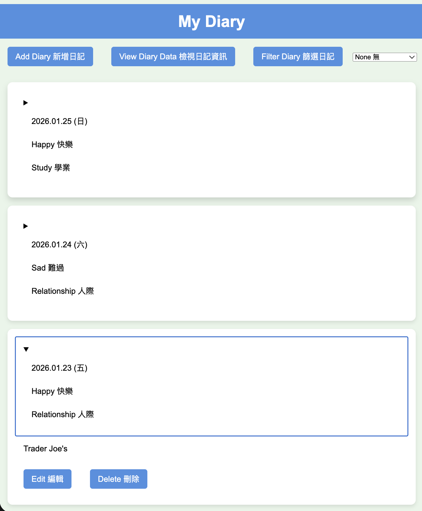

# Full-stack application - My Diary

## Table of Contents
- [Overview](#overview)
- [Features](#features)
- [Tech Stack](#tech-stack)
- [Installation](#installation)
- [Running the App](#running-the-app)
- [Advanced Features](#advanced-features)
- [Lint Check](#lint-check)
- [Project Structure](#project-structure)

## Overview
My Diary is a full-stack web application that allows users to create, edit, filter, and manage personal diary entries with mood and tag categorization.



## Features
- Create, read, update, and delete diary entries
- Filter diaries by mood and tag
- Date validation using HTML5 date picker
- Responsive UI with modal dialogs
- MongoDB integration for persistent storage
- RESTful API backend


## 🛠️ Tech Stack
- **Frontend:** HTML5, CSS3, JavaScript (Vanilla), Axios
- **Backend:** Node.js, Express.js
- **Database:** MongoDB
- **Tools:** ESLint, Prettier, Nodemon


## Installation (The advanced feature implementation is described below )
Follow the instructions in this section to run the app locally.

### 1. setup backend `.env`

Start by creating the `.env` file in the backend folder, then fill the `PORT` and  `MONGO_URI` with 8000 and ur MongoDB URL.

```bash
PORT=8000
MONGO_URI="mongodb+srv://<username>:<password>@<cluster>.example.mongodb.net/?retryWrites=true&w=majority"
```

### 2. setup backend node_modules

Run this command to install the node modules in backend.

```bash
cd backend
yarn install
cd ..
```

### 3. setup frontend node_modules

Run this command to install the node modules in frontend.

```bash
cd frontend
yarn install
cd ..
```


## Running the App

### 1. Run the backend server 

Run the following command to start the server and connect to MongoDB.

```bash
cd backend
yarn start
```

The server will run on `http://localhost:8000`

### 2. Open the website

Open `frontend/index.html` in your browser to launch the web app. Everything should work fine now.


## Advanced Features Implementation 進階條件實作內容說明

### 1. Restricting Selection to Valid Dates 限制選取合法日期
Uses HTML5 date input to restrict users to selecting only valid dates through the browser's built-in date picker. 透過 html 中的 input 設定，限制使用者只能選取合法日期。

```html
<input type="date" id="diaryDate" />
```

### 2. Filtering Diary Cards by Mood and Tag 利用心情以及標籤篩選日記卡
A diary filtering feature is implemented in `script.js` on the frontend. The implementation follows these steps:

- Remove all currently rendered diary card elements from the DOM.
- Keep all diary data stored in a frontend cache (`diaryData`).
- If the selected filter option is "None 無" (no filtering), re-render all diary cards.
- Otherwise, iterate through the cached diary data and render only entries whose mood or tag matches the selected filter.

This approach avoids additional backend requests and achieves client-side filtering efficiently.

在前端的 script.js 中，新增一個篩選日記卡功能。先刪除所有當前的日記卡片元素，保留前端快取資料，若選擇"無"則重新渲染所有日記卡；否則過濾出符合指定心情或標籤的日記條目並重新渲染。

```javascript
FilterDiaryBtn.addEventListener("click", function () {
  const ThingToFilter = document.getElementById("FilterSelect").value;

  // Remove all currently rendered diary card elements 刪除所有當前的日記卡片元素
  const diaryCards = document.querySelectorAll("details");
  diaryCards.forEach((card) => card.remove());

  // If no filtering is selected, re-render all diary entries 檢查 ThingToFilter 是否為"None 無"
  if (ThingToFilter === "None 無") {
    diaryData.forEach((entry) => {
      render_diary(entry);
    });
  } else {
    // Filter diary entries by mood or tag 過濾出符合指定心情（或標籤）的日記條目
    const filteredDiaries = diaryData.filter(
      (entry) => entry.mood === ThingToFilter || entry.tag === ThingToFilter,
    );

    // Re-render filtered diary entries 重新渲染過濾後的日記條目
    filteredDiaries.forEach((entry) => {
      render_diary(entry);
    });
  }
});
```


## Lint Check

### 1. Frontend Lint Check
 
```bash
cd frontend
yarn lint
```

### 2. Backend Lint Check
 
```bash
cd backend
yarn lint
```


## Project Structure

```
my_diary/
├── frontend/
│   ├── index.html
│   ├── script.js
│   ├── styles.css
│   └── package.json
├── backend/
│   ├── index.js
│   ├── controller/
│   │   └── diary.js
│   ├── models/
│   │   └── diary.js
│   ├── routes/
│   │   └── diary.js
│   ├── .env
│   └── package.json
└── README.md
```
